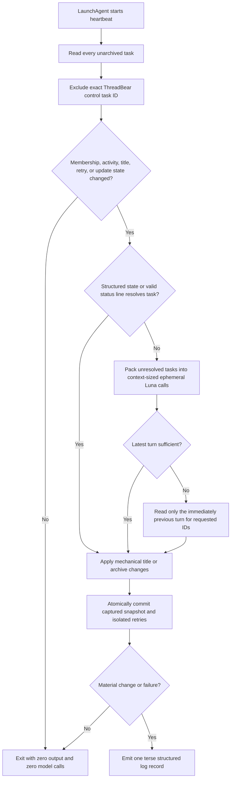

# ThreadBear - Plan

## Goal Capsule

- **Objective:** Ship ThreadBear v1 as a public, playful macOS utility that keeps every managed unarchived Codex task other than its control task visibly classified, usefully named, and safely retired while spending no model tokens on an unchanged heartbeat.
- **Authority hierarchy:** The Product Contract owns behavior and scope. The Planning Contract owns implementation choices. A current generated Codex App Server schema and a read-only compatibility check outrank prototype assumptions about local storage.
- **Execution profile:** Greenfield Go implementation in a new public repository, delivered as independently verifiable implementation units. The private prototype and evaluation corpus are evidence, not code to publish wholesale.
- **Stop conditions:** Stop before task mutation if the Codex inventory schema or required App Server methods cannot be feature-detected. Stop release if ephemeral classifier sessions persist visibly or a zero-model control-task notice cannot be proven through a supported surface.
- **Tail ownership:** The final implementation unit owns public documentation, release artifacts, `threadbear.sh`, migration verification, and the proof that the installed LaunchAgent is the only active ThreadBear/ThreadWatch scheduler.

---

## Product Contract

Product Contract preservation: A1-A5, R1-R40, F1-F6, and AE1-AE18 retain their established meaning except for the user-confirmed replacement of persistent control-task classification with non-persisted Luna sessions; R41-R42 add the confirmed diagnostic and archive-restoration surfaces; R43 makes the classifier model and effort configuration values (2026-07-23 amendment).

### Summary

ThreadBear v1 ports the proven prepare-mutate-commit heartbeat into a standalone Go product, keeps the zero-Codex idle gate on a read-only local index, and uses fresh non-persisted Luna-medium sessions only for unresolved changed tasks.
One visible control task remains the management and notification surface, while context-sized batching, conservative archiving, failure-safe staged replacement, and synthetic public regression fixtures keep the product predictable without arbitrary caps or a rollback subsystem.

### Problem Frame

Codex tasks accumulate faster than a user can reopen and reassess them.
The sidebar does not expose whether a task is active, blocked, waiting for the user, complete, or an idle automation, and stale generic titles hide the next action.
A recurring model-driven monitor would solve the visibility problem by paying to rediscover an unchanged world every few minutes.

The ThreadWatch prototype proved that local inventory, freshness checks, structured runtime state, title mutation, and state persistence can be mechanical.
It also exposed failure modes the product must avoid: arbitrary list caps omit tasks, clipped messages can remove the final disposition, free-form regexes can mistake quoted language for the current state, and unsupported Desktop state-file edits lose to the app's in-memory cache.
Its long-running classifier task also accumulated more than five million input tokens; recent tiny classifier turns replayed roughly 92,000-138,000 input tokens each.
ThreadBear therefore keeps the visible control task but moves semantic classification into fresh ephemeral contexts that never appear in the task database or sidebar.

### Key Decisions

- **The heartbeat belongs to a macOS LaunchAgent.** (session-settled: user-directed — chosen over a recurring Codex automation: unchanged runs must consume zero model tokens) Governs R4, R5, R8, R23, R36.
- **The semantic classifier defaults to Luna medium and is configurable.** (session-settled: user-approved — chosen over Luna low, Luna high, Luna xhigh, Terra low, and Terra medium: the benchmark favored medium's lower false-complete risk. Amended 2026-07-23: the model and effort are configuration values so a model deprecation is a config edit, not a binary release.) Governs R13, R14, R15, R16, R17, R18, R43.
- **Semantic classification uses non-persisted sessions.** (session-settled: user-approved — chosen over reusing or later archiving classifier tasks: fresh ephemeral sessions avoid control-task history replay and never create sidebar clutter) Governs R3, R13, R15, R36.
- **The product is a standalone Go binary.** (session-settled: user-approved — chosen over Python or Node.js: users should not install a language runtime) Governs R27, R32, R33, R34.
- **A managed AGENTS.md convention is offered by default.** (session-settled: user-directed — chosen over inference-only classification: a compact terminal signal is cheaper and clearer when agents provide one) Governs R10, R11, R12, R26, R28.
- **Automatic titles retain a durable subject and add the current next action.** (session-settled: user-directed — chosen over opaque slugs or next-action-only titles: the task must remain recognizable as its next step changes) Governs R19, R20, R21.
- **Next steps is a primary state alongside completion.** (session-settled: user-directed — chosen over replacing completion with a broad follow-up state: completion must always remain available) Governs R10, R16, R17, R19, R22.
- **Automatic archiving is conservative.** (session-settled: user-approved — chosen over archiving every inactive task: unfinished work must remain visible) Governs R22.
- **Installation uses one final confirmation.** (session-settled: user-directed — chosen over approval before every mutation: the user sees the complete change set without a noisy walkthrough) Governs R24, R25, R26.
- **Updates replace the installed binary with the selected release.** (session-settled: user-directed — chosen over local version directories and automatic rollback: downgrade-by-version is sufficient and avoids a release-management subsystem) Governs R33, R34, R35, R36.
- **The v1 product does not manipulate Desktop organization.** (session-settled: user-directed — chosen over pinning, projects, folders, sidebar cache edits, and screen automation: no supported reliable control surface was found) Governs R40.
- **ThreadBear v1 is macOS-only, MIT-licensed, and distributed without Developer ID signing or notarization.** (session-settled: user-directed — chosen over premature Windows support, Developer ID distribution, and a more complex license: ship the smallest supportable public product) Governs R1, R2, R32, R33.

### Actors

- A1. **Codex user:** installs and configures ThreadBear, reads task titles and control-task notices, approves user-initiated updates, and can override automated titles or archive settings.
- A2. **ThreadBear runtime:** performs deterministic inventory, freshness, state, mutation, update-check, and persistence work from the LaunchAgent.
- A3. **ThreadBear classifier:** runs Luna medium in fresh non-persisted sessions only when semantic judgment is required.
- A4. **Codex Desktop:** owns the task index, task content, automation registry, persistent task titles, archives, and the sidebar rendering cache.
- A5. **Release host:** serves the installer, release metadata, checksums, and versioned macOS binaries from `threadbear.sh` and the public GitHub repository.

### Requirements

**Product identity and ownership**

- R1. The public product is named ThreadBear, uses the control-task title `🧵🐻 ThreadBear 🐻🧵`, is documented at `threadbear.sh`, and lives in a public `ericlitman/threadbear` GitHub repository. `threadbare.sh` is a second registered domain that redirects to `threadbear.sh`; it is a deliberate play on the word rather than a typo guard, and it is never the canonical origin published in documentation, installer commands, or release metadata.
- R2. The repository is MIT-licensed, the default language is playful and bear-themed without obscuring operational meaning, v1 supports macOS only, and v1 release binaries ship without Developer ID signing or notarization.
- R3. ThreadBear owns one long-running visible control task whose exact task ID is recorded during setup and excluded from inventory before freshness checks; the task is used for management and notices, never as accumulated classifier history.

**Inventory and deterministic heartbeat**

- R4. Every heartbeat inventories the complete set of Codex Desktop tasks that are currently unarchived, with no fixed count, recency window, pagination shortcut, or delegated-task exclusion.
- R5. ThreadBear compares the captured inventory with an atomically persisted snapshot of membership, activity, title, and retry state, then exits before starting Codex App Server or a model when no relevant fact changed.
- R6. Deterministic evidence sets `needs_input` for an active turn explicitly waiting on approval or user input, `running` for any other active runtime or in-progress turn, `blocked` for a structured turn error, `automation` for a healthy active scheduled task that is idle, and `unknown` for an interrupted or cancelled turn without a final disposition.
- R7. Free-form task prose never determines `blocked` through a keyword or regular-expression rule because quoted or historical language is not authoritative current state.
- R8. The inventory snapshot is captured before classification and becomes the committed comparison point after successful processing, so activity arriving during classification remains fresh on the next heartbeat.
- R9. A failure on one task adds that task to deterministic retry state without preventing successful tasks from being committed or requiring the entire inventory to be reclassified.

**Compact agent status signal**

- R10. When enabled, a managed global AGENTS.md block asks agents to end a terminal response with exactly one compact human-readable status line in one of two shapes: `🧵🐻 STATUS` for terminal states that carry no follow-up, or `🧵🐻 STATUS (OWNER): ACTION` for states that do. STATUS is `complete`, `next steps`, `needs input`, `blocked`, or `automation`; OWNER is `you`, `agent`, `external`, or `none`. `complete` and `automation` take the bare shape; `next steps`, `needs input`, and `blocked` always name an owner and a concrete action.
- R11. The managed guidance says, “Report the turn's actual disposition; do not invent or recommend work to populate this line. After finished work, use `complete` unless the substantive response already ends with one clear, concrete, warranted next step; generic offers, speculative possibilities, and mentions of recorded work do not qualify.”
- R12. ThreadBear parses a valid R10 footer from the final non-empty line as the preferred semantic signal without a model call, removes it from generated title text, and falls back to recent-turn classification only when the footer is absent, malformed, stale, or contradicted by structured state.

**Model-assisted classification**

- R13. Only changed tasks that remain unresolved after R6 and R12 are sent to Luna medium in fresh ephemeral sessions with tools and environments disabled; ThreadBear uses the fewest batches that fit the model's advertised context and serialized payload rather than a fixed task-count cap.
- R14. The first classification input contains the complete latest user message and complete latest final agent message, with no fixed character clipping and no tool output, hidden reasoning, or older history; a single turn that cannot fit safely becomes `unknown` with diagnostic retry state instead of being clipped or omitted.
- R15. The classifier may request the immediately previous turn only when the latest turn is insufficient, and ThreadBear performs that second read only for the task IDs that requested it in another fresh ephemeral session.
- R16. The classifier returns one `blocked`, `needs_input`, `running`, `automation`, `next_steps`, `complete`, or `unknown` state plus any needed concise subject and next action for every requested task in the same call, then leaves all title, archive, inventory, and state mutations to the deterministic runtime.
- R17. `next_steps` means the current request is complete and the agent explicitly recommends a concrete follow-up action, while `complete` remains available for finished work with no recommendation, generic offers of more help, or mentions of already-recorded follow-up work.
- R18. `needs_input` means unfinished work requires a user choice, approval, credential action, or missing information, while `blocked` means progress requires new authority, an external-state change, or recovery from a failed turn.

**Title and lifecycle management**

- R19. Every classified unarchived task has exactly one canonical leading emoji: `⏳` running, `🚨` blocked, `🙋` needs input, `🤖` automation, `➡️` next steps, `✅` complete, or `❔` unknown.
- R20. With automatic renaming enabled, ThreadBear formats the title as the R19 emoji, a durable user-recognizable subject, and a concise current next action when one exists; it removes a stale next-action suffix when none exists.
- R21. ThreadBear updates only its status prefix and managed next-action portion, preserves a user-edited subject, and never compounds prefixes or accumulates prior next actions.
- R22. With automatic archiving enabled, ThreadBear archives only tasks that have remained `complete` and inactive for the configured interval, which defaults to 14 days; it never auto-archives `running`, `blocked`, `needs_input`, `automation`, `next_steps`, or `unknown`.
- R23. A heartbeat with no material title, archive, retry, or update-notice change writes zero bytes to standard output; a changed or failed heartbeat emits one terse structured record suitable for logs.

**Guided installation and configuration**

- R24. The supported entry point is `curl -fsSL https://threadbear.sh/install.sh | sh`, and the installer reads interactive answers from `/dev/tty` so piped script input cannot consume the prompts.
- R25. Before mutation, the installer explains the product, the deterministic-first token model, the installed paths, the LaunchAgent, the persistent control task, and every selected preference, then asks for one final confirmation.
- R26. On first install the installer asks for heartbeat interval, automatic archiving and inactivity interval, automatic next-action renaming, and managed AGENTS.md instructions; defaults are five minutes, archiving on after 14 days, renaming on, and AGENTS.md instructions on.
- R27. Installation requires no `sudo`, installs the binary at `~/.local/bin/threadbear`, persists state under `~/.local/share/threadbear`, and registers the LaunchAgent as `org.litman.threadbear`.
- R28. The installer preserves existing AGENTS.md content, inserts or updates one identifiable managed ThreadBear block idempotently, previews that mutation, and can remove only that block without touching surrounding user content.
- R29. `INSTALL.md` is written for an installing agent and documents the same choices, non-interactive flags, exit behavior, verification commands, and exact final effects as the guided installer.
- R30. `threadbear configure` can change every onboarding preference later and applies LaunchAgent changes without duplicating jobs, state, control tasks, or AGENTS.md blocks.
- R31. An existing ThreadWatch prototype installation can be migrated to ThreadBear without losing its control-task identity, classifications, retry state, or user preferences, after which active paths and internal references use `threadbear` exclusively.

**Distribution and updates**

- R32. Releases provide standalone pure-Go `darwin/arm64` and `darwin/amd64` binaries that do not require Go, cgo, Python, Node.js, or another end-user runtime.
- R33. The installer selects the latest release by default, accepts an exact version as `--version 1.2.0` without a `v` prefix, selects the host architecture, verifies the published SHA-256 checksum, and fails without replacing a working binary when validation fails.
- R34. `threadbear update` resolves the selected release, downloads it to a temporary path, verifies its checksum and executable self-test, then replaces the installed binary only after those checks pass.
- R35. An update invoked from the control task uses Codex's normal command approval, lets the user choose one-time or Always approval in the standard permission panel, and neither requests full-access defaults nor bypasses task permissions.
- R36. Once per day, a deterministic check compares the installed version with the latest release and remains silent when current; when a newer version exists, it places one notice per version in the control task using `🧵🐻 ThreadBear VERSION is ready. Run threadbear update, or tell me “update ThreadBear.”`.

**Operability and removal**

- R37. `threadbear status` reports installed version, LaunchAgent health, last completed heartbeat, control-task identity, enabled preferences, pending retries, and last update check without invoking a model.
- R38. `threadbear self-test` validates supported macOS and architecture, required local Codex surfaces, state-directory access, configuration integrity, and binary health without mutating task titles or archives.
- R39. `threadbear uninstall` previews and removes the LaunchAgent, binary, update-notice integration, and managed AGENTS.md block, then asks separately whether to archive the control task and whether to retain or delete persistent state. *(Amended 2026-07-27: BEAR-62 supersedes the retention choice. Interactive uninstall thanks the operator, defaults control-task archival and final confirmation to yes, and always deletes persistent state; noninteractive confirmed uninstall also always deletes state.)*
- R40. ThreadBear does not edit `.codex-global-state.json`, use private sidebar cache invalidation, click through Desktop UI, or claim that an externally persisted title must render immediately in an already-open sidebar.
- R41. `threadbear status`, `threadbear inspect TASK_ID`, and every read-only preview support stable human-readable and `--json` output; `threadbear heartbeat --dry-run` performs inventory and deterministic analysis without task mutations or model calls.
- R42. `threadbear enable` and `threadbear disable` manage the LaunchAgent idempotently, while `threadbear restore TASK_ID` can unarchive only a task recorded as archived by ThreadBear and restarts that task's inactivity clock.
- R43. The classifier model and reasoning effort are configuration values stored in `config.json` (`classifier_model`, `classifier_effort`), defaulting to `gpt-5.6-luna` and `medium`; `threadbear configure` changes them without reinstalling, `threadbear status` reports the active pair, and every requirement that names Luna medium binds to the configured values. The App Server model/effort override for the configured pair is feature-detected like every other capability.

The heartbeat decision boundary is intentionally narrow:



### Key Flows

- F1. Guided first installation
  - **Trigger:** A1 runs the supported shell invocation.
  - **Actors:** A1, A2, A4, A5.
  - **Steps:** The installer detects compatibility, explains the architecture, collects R26 preferences, previews all effects, receives one confirmation, installs the selected verified binary, creates or adopts the control task, writes state, updates the managed AGENTS.md block when enabled, registers the LaunchAgent, and runs the self-test.
  - **Outcome:** One healthy ThreadBear installation exists with no duplicate control task or LaunchAgent.
  - **Covers R1-R3, R24-R33, R38.**

- F2. Unchanged heartbeat
  - **Trigger:** The LaunchAgent fires and the complete unarchived inventory matches the last snapshot.
  - **Actors:** A2, A4.
  - **Steps:** ThreadBear reads the inventory, excludes its control task, compares deterministic state, performs any due update metadata comparison, routes a newly available undelivered version to F5, and otherwise exits at the R5 gate.
  - **Outcome:** When no update notice is required, no classifier turn, task mutation, or output occurs.
  - **Covers R3-R5, R23, R36.**

- F3. Changed-task classification
  - **Trigger:** One or more tasks changed or are pending retry.
  - **Actors:** A2, A3, A4.
  - **Steps:** ThreadBear applies R6 and R12, packs only unresolved tasks into the fewest context-safe ephemeral calls under R13, reads previous turns only under R15, revalidates every mutation precondition, applies R19-R21, and atomically records the captured snapshot under R8-R9.
  - **Outcome:** Every processable changed task has a current state without model work on mechanically resolved tasks.
  - **Covers R6-R21, R23.**

- F4. Safe inactivity archive
  - **Trigger:** An unarchived task reaches the configured inactivity interval.
  - **Actors:** A2, A4.
  - **Steps:** ThreadBear evaluates the current classification and activity timestamp, archives only when R22 permits it, and records the material change.
  - **Outcome:** Old completed work leaves the active list while every open loop remains visible.
  - **Covers R22-R23.**

- F5. Available update and approved replacement
  - **Trigger:** The daily check sees a newer release, or A1 requests a specific update.
  - **Actors:** A1, A2, A4, A5.
  - **Steps:** ThreadBear emits the R36 notice once, waits for user action, follows normal Codex approval when invoked from the control task, validates the selected binary, and replaces the installed binary under R33-R35.
  - **Outcome:** Updates are visible and easy without unattended code replacement or a local rollback system.
  - **Covers R33-R36.**

- F6. Reconfiguration or removal
  - **Trigger:** A1 runs `threadbear configure` or `threadbear uninstall`.
  - **Actors:** A1, A2, A4.
  - **Steps:** ThreadBear previews the requested effects, updates or removes only managed resources, and preserves unrelated files and AGENTS.md content.
  - **Outcome:** Settings remain reversible and removal leaves no running ThreadBear job.
  - **Covers R28, R30, R37-R39.**

### Acceptance Examples

- AE1. Idle means zero
  - **Covers R4-R5, R23.**
  - **Given:** All 137 unarchived tasks match the captured snapshot and no update check is due.
  - **When:** The five-minute heartbeat runs.
  - **Then:** ThreadBear inventories all 137 tasks, starts no App Server or classifier turn, mutates nothing, and writes zero bytes.

- AE2. Active work is mechanical
  - **Covers R6, R13, R19.**
  - **Given:** A task has an active runtime and its title begins with `✅`.
  - **When:** The heartbeat sees the changed runtime state.
  - **Then:** ThreadBear changes the canonical prefix to `⏳` without asking Luna.

- AE3. Structured failure wins
  - **Covers R6-R7, R12, R18-R19.**
  - **Given:** The latest turn has a structured error while its prose quotes an earlier successful result.
  - **When:** ThreadBear classifies the task.
  - **Then:** The task becomes `🚨` from structured evidence, regardless of the prose.

- AE4. Quoted blocked language is semantic
  - **Covers R7, R13, R18.**
  - **Given:** A completed explanatory response says another task “remains blocked” but reports that the current request is finished.
  - **When:** The heartbeat processes the response.
  - **Then:** No keyword rule marks the current task blocked; Luna or the R10 signal determines its state.

- AE5. Full final disposition is preserved
  - **Covers R14-R15.**
  - **Given:** A long final agent message describes unsuccessful attempts early and states successful completion at the end.
  - **When:** ThreadBear builds the classification input.
  - **Then:** The complete final message reaches Luna, so the completion sentence is not clipped.

- AE6. History expands only on demand
  - **Covers R14-R15.**
  - **Given:** Ten changed tasks require semantic classification and two return insufficient evidence from their latest turn.
  - **When:** ThreadBear completes the batch.
  - **Then:** Only those two tasks receive their immediately previous turn in a second classifier request.

- AE7. User-owned next action stays visible
  - **Covers R10, R12, R18-R22.**
  - **Given:** The final line is `🧵🐻 needs input (you): choose the release region`.
  - **When:** ThreadBear updates the title and later evaluates inactivity.
  - **Then:** The title begins `🙋`, includes the release-region action, omits the status line itself, and cannot be auto-archived.

- AE8. Completed work ages out safely
  - **Covers R17, R22.**
  - **Given:** Automatic archiving is enabled at 14 days and a task has remained complete and inactive for 15 days.
  - **When:** The heartbeat runs.
  - **Then:** ThreadBear archives the task; an equally old next-steps, automation, unknown, blocked, or needs-input task remains unarchived.

- AE9. Installer preserves the user's environment
  - **Covers R24-R30.**
  - **Given:** The user has a populated global AGENTS.md and accepts all defaults.
  - **When:** The piped installer receives final confirmation.
  - **Then:** Existing text remains byte-for-byte outside one managed ThreadBear block, one LaunchAgent is loaded, and rerunning the installer creates no duplicates.

- AE10. Exact-version installation is explicit
  - **Covers R32-R34.**
  - **Given:** Release 1.2.0 exists for the current architecture.
  - **When:** The user invokes the installer with `--version 1.2.0`.
  - **Then:** The installer fetches and verifies 1.2.0; `--version v1.2.0`, an absent checksum, or a failing self-test stops before replacement.

- AE11. Update notices do not repeat
  - **Covers R35-R36.**
  - **Given:** ThreadBear 1.1.0 is installed and 1.2.0 is available.
  - **When:** Daily checks run for three days without an update.
  - **Then:** The control task receives one `🧵🐻` notice for 1.2.0, unchanged checks remain silent, and no binary changes until A1 approves an update.

- AE12. Sidebar cache is not treated as authority
  - **Covers R19-R21, R40.**
  - **Given:** Codex accepts a persistent title update while the already-open sidebar still renders its cached title.
  - **When:** ThreadBear verifies the mutation.
  - **Then:** It verifies persistent task state, avoids private cache kicks and global-state edits, and allows the sidebar to converge on a later supported refresh.

- AE13. Interrupted work stays conservative
  - **Covers R6, R19, R22.**
  - **Given:** A task was cancelled after partial work and has no final disposition.
  - **When:** The heartbeat processes it.
  - **Then:** The task becomes `❔` and remains in the active list regardless of age.

- AE14. A concrete recommendation creates a next-steps state
  - **Covers R10, R16-R19, R22.**
  - **Given:** The current request is complete and the final response says, “The next move is to pressure-test the requirements before implementation.”
  - **When:** ThreadBear classifies the task.
  - **Then:** The title begins `➡️`, carries that concise next action, and remains unarchived until it becomes `complete` or the user archives it.

- AE15. A generic offer does not consume completion
  - **Covers R17, R19, R22.**
  - **Given:** The current request is complete and the final response ends, “If you want, I can help with that.”
  - **When:** ThreadBear classifies the task.
  - **Then:** The task remains `✅` because the response offered capability without recommending a concrete follow-up.

- AE16. Stronger unfinished states outrank suggestions
  - **Covers R6, R17-R19.**
  - **Given:** A response recommends a next action but also requires a user choice to finish the current request.
  - **When:** ThreadBear classifies the task.
  - **Then:** The task becomes `🙋`, because `➡️` applies only after the current request is complete.

- AE17. The task agent declares next steps without another model call
  - **Covers R10-R13, R19-R20.**
  - **Given:** A completed final response ends with `🧵🐻 next steps (agent): create the implementation plan`.
  - **When:** The heartbeat processes the changed task.
  - **Then:** ThreadBear deterministically applies `➡️` and the stated action without sending the task to Luna.

- AE18. ThreadBear guidance does not manufacture follow-up work
  - **Covers R10-R12, R17.**
  - **Given:** The current request is complete and the agent has no clear warranted recommendation beyond generic possibilities.
  - **When:** The agent writes its final response and footer.
  - **Then:** It does not add a recommendation for ThreadBear's sake and ends with `🧵🐻 complete`.

- AE19. Classifier work never creates sidebar tasks
  - **Covers R3, R13-R15.**
  - **Given:** The visible control task contains years of history and three changed tasks need Luna.
  - **When:** ThreadBear performs semantic classification.
  - **Then:** It uses fresh non-persisted Luna-medium sessions, appends nothing to the control task, and leaves no classifier task to archive.

- AE20. Context limits split work without a task cap
  - **Covers R4, R13-R16.**
  - **Given:** The complete serialized latest turns for unresolved tasks cannot fit in one advertised Luna context but each individual task can fit.
  - **When:** ThreadBear prepares classification.
  - **Then:** It uses the fewest context-safe calls needed, includes every task exactly once, and clips or omits nothing.

- AE21. Activity during classification blocks a stale mutation
  - **Covers R8-R9, R19-R22.**
  - **Given:** A user adds a message or edits a title after ThreadBear captures a task but before its title or archive mutation.
  - **When:** ThreadBear revalidates the mutation precondition.
  - **Then:** It skips that mutation, commits successful siblings, and leaves the changed task fresh for the next heartbeat.

- AE22. Manual unarchive receives a new grace period
  - **Covers R22, R42.**
  - **Given:** ThreadBear archived an inactive completed task and the user later restores it in Codex or with `threadbear restore`.
  - **When:** The following heartbeat sees the task unarchived.
  - **Then:** ThreadBear restarts its inactivity clock and does not archive it again immediately.

- AE23. A failed candidate update never replaces the working binary
  - **Covers R33-R34.**
  - **Given:** The downloaded candidate has a missing checksum, checksum mismatch, wrong version, or failing self-test.
  - **When:** Installation or update validates the candidate.
  - **Then:** ThreadBear removes the temporary candidate, leaves the installed binary untouched, and creates no rollback state.

- AE24. Read-only diagnosis stays read-only
  - **Covers R37-R42.**
  - **Given:** A task has an unexpected emoji and the user or control-task agent runs inspection and a dry-run heartbeat.
  - **When:** ThreadBear reports the task's evidence, precedence source, next action, and pending retry.
  - **Then:** Human-readable and JSON output agree, no model runs, and no title, archive, configuration, or scheduler state changes.

### Success Criteria

- The idle-path integration test proves zero classifier invocations and zero stdout for an unchanged complete inventory.
- Footer-path integration tests prove every valid AGENTS.md status maps deterministically without a classifier invocation, generic completions do not fabricate next actions, and malformed or contradictory footers fall through safely.
- Inventory tests prove every unarchived Desktop-visible task is considered across pagination, age, project membership, and delegated-task shapes.
- The frozen benchmark and challenge corpus cover all seven semantic states and retain zero false-complete or false-next-steps results for the deterministic-plus-Luna-medium cascade.
- Ephemeral-classifier integration tests prove classifier input cost is independent of control-task history and that no classifier task persists in Codex storage.
- Clean installs and exact-version updates pass on both Apple silicon and Intel macOS without a Go or scripting-language runtime.
- Destructive-behavior tests prove that automatic archiving cannot select an unfinished state and that AGENTS.md edits remain confined to the managed block.
- A user can understand the installer's effects and token behavior before the single confirmation, then verify or diagnose the installation with `threadbear status`, `threadbear inspect`, and `threadbear self-test`.

### Scope Boundaries

**Deferred for later**

- Windows support is a v2 concern after the macOS product establishes a stable local adapter and distribution contract.
- Developer ID signing and notarization can be added when the distribution volume or Gatekeeper friction justifies the Apple release process.
- Supported project, folder, or pin organization can be reconsidered when OpenAI exposes a reliable task-management API with live Desktop refresh.

**Outside this product's identity**

- ThreadBear does not click through the user's screen, edit private Desktop global-state files, reverse-engineer cache invalidation, or depend on whichever task happens to be selected.
- ThreadBear does not maintain local release history, implement automatic rollback, invent a custom Codex permission profile, or ask users to grant full access. *(Amended 2026-07-26: this bullet originally also said "does not install updates without user action." That clause is superseded by owner decision — opt-out auto-update with consent collected at install, default yes, `configure --auto-update` to disable — contracted in `docs/plans/2026-07-26-001-feat-auto-update-plan.md` [BEAR-39]. The no-release-history and no-automatic-rollback boundaries stand.)*
- ThreadBear is a local task-state and lifecycle manager, not a general Codex orchestration framework, project planner, task scheduler, or cross-platform Desktop replacement.

### Dependencies and Assumptions

- Codex Desktop must expose the current `threads` index shape for a read-only idle scan and the required persistent title, archive, unarchive, ephemeral-thread, and turn methods through a compatibility-detectable App Server surface.
- Immediate repaint of an already-open sidebar is not a v1 guarantee; persistent task state is authoritative and the UI may converge on later task activity or app refresh.
- A supported zero-model App Server operation must prove that it can place a concise user-visible update notice into the control task; release stops if that proof fails.
- Installation and updates require HTTPS access to `threadbear.sh` or GitHub, while ordinary heartbeats remain local except for due release-metadata checks and Luna calls on semantically unresolved changes.
- The public release process can publish matching checksums and two macOS binaries from the same versioned source.
- The development and release environment may use Go tooling, but the installed product cannot require it.

### Sources and Research

- `outputs/thread-status-benchmark.md` in the private `ericlitman/threadbear-eval` repository (relocated there 2026-07-23 from the Codex scoping workspace) records the corrected inventory audit, Luna tier comparison, deterministic guard, adaptive token cost, and live prototype validation.
- `thread-status-eval/full-corpus.json`, `thread-status-eval/ground-truth.json`, and `thread-status-eval/runs-v2/` in `ericlitman/threadbear-eval` preserve the evaluated cases and raw model results; the corpus contains real user messages and must never enter the public tree, and it also contains explicit recommendations, follow-up references, generic offers, and higher-precedence unfinished states for the `next_steps` boundary test.
- `codex app-server generate-json-schema --experimental` on `codex-cli 0.145.0` verifies the current ephemeral-thread, model/effort override, title, archive, unarchive, and raw-item insertion surfaces used by the compatibility plan.
- [BEAR-1](https://linear.app/mobilyze-llc/issue/BEAR-1) is the durable product work item (team slug changed from BEA to BEAR on 2026-07-23).
- [Apple Platform Security: System Integrity Protection](https://support.apple.com/en-au/102149) establishes that SIP protects system locations rather than requiring notarization for a user-local Go binary.
- [Apple Developer ID](https://developer.apple.com/developer-id/) and [Notarizing macOS software before distribution](https://developer.apple.com/documentation/security/notarizing-macos-software-before-distribution) describe the distribution trust path deferred from v1.
- [Go minimum requirements](https://go.dev/wiki/MinimumRequirements) establishes macOS 12 Monterey as the supported floor for the selected Go toolchain.
- [`modernc.org/sqlite`](https://pkg.go.dev/modernc.org/sqlite) provides the cgo-free read-only SQLite driver for `darwin/arm64` and `darwin/amd64`.

---

## Planning Contract

### Key Technical Decisions

- KTD1. Use a two-surface Codex adapter: a cgo-free SQLite connection opened with `mode=ro` performs the idle inventory and freshness gate, while one short-lived App Server process performs changed-task reads, ephemeral model work, notices, and all mutations. The SQLite adapter validates required columns before every scan and never writes Codex storage; App Server methods are feature-detected before any mutation. This preserves the literal zero-Codex idle path without treating an internal schema as permanently stable. Governs R3-R9, R37-R40.

- KTD2. Start each semantic call with App Server `thread/start` using `ephemeral: true`, then run the configured classifier model (default Luna medium; R43) with an output schema, no environments, no tools, no approvals, and no persisted history. (session-settled: user-approved — chosen over reusing or auto-archiving classifier tasks: non-persisted sessions eliminate control-task history replay and never create sidebar tasks) The visible control task is reserved for user commands and update notices. Governs R3, R13-R16, R35-R36, R43.

- KTD3. Pack unresolved candidates by the complete serialized payload against the model's advertised context window, reserving measured prompt/schema overhead and using a conservative UTF-8 byte upper bound when no tokenizer count is exposed. ThreadBear starts with one call and adds calls only when the payload cannot fit; it never uses a fixed task count, silently drops a task, or truncates a message. An individually oversized task becomes `unknown` with a stable diagnostic and retry record. Governs R4, R13-R16.

- KTD4. Implement state precedence as one pure decision table: active waiting flags, active runtime, structured failure, registered automation, interruption, strict latest-turn footer, and finally Luna. A footer is current only when it is the final non-empty line of the latest completed agent turn and no newer user message exists. Invalid owner/action pairs, contradictions with structured evidence, quoted footers, and generic next-step offers fall through to Luna. Governs R6-R18.

- KTD5. Persist title ownership instead of inferring it from delimiters. State records the durable subject, managed next action, and exact last title ThreadBear wrote. When the current title still matches that value, ThreadBear renders `EMOJI SUBJECT → ACTION` and may replace or remove the action; when it differs, the non-status portion becomes the user's new subject and no old managed suffix is stripped by pattern matching. This keeps `→` human-readable without claiming ownership of user text that merely resembles it. Governs R19-R21.

- KTD6. Preserve the prototype's prepare-mutate-commit transaction with a versioned cycle checkpoint and one non-blocking process lock shared by install, migration, heartbeat, configure, update, enable/disable, restore, and uninstall. Classification results are checkpointed by captured task revision before mutation, every title/archive write revalidates activity, title, and archive state, and the final atomic state generation overlays verified post-mutation rows plus isolated retries. A restart reuses a matching classifier checkpoint and converges without paying for the same Luna result twice. Governs R5, R8-R9, R21-R23, R30, R34, R39-R42.

- KTD7. Separate inventory freshness from substantive inactivity. Inventory membership, title, and row revision drive the heartbeat gate; the newest persisted user/agent turn timestamp drives archive age. ThreadBear's own title writes and notices never advance substantive activity. A manual unarchive or `threadbear restore` starts a fresh inactivity grace period, and only archives explicitly recorded by ThreadBear are eligible for CLI restoration. Governs R8, R22, R42.

- KTD8. Put one application service behind both the LaunchAgent and CLI. Commands are `install`, `heartbeat`, `status`, `inspect`, `configure`, `enable`, `disable`, `restore`, `self-test`, `update`, `uninstall`, and `version`; human output and stable JSON serialize the same typed result objects. `heartbeat --dry-run` stops before App Server or model work and reports unresolved candidates rather than pretending to classify them. This gives the control-task agent diagnostic parity without raw state edits. Governs R23, R29-R30, R37-R42.

- KTD9. Make installation a staged, idempotent transaction rather than a rollback system. The shell bootstrap downloads one selected binary to a temporary file, verifies SHA-256 and `self-test`, then delegates onboarding to that binary. The binary previews all effects, receives one confirmation, writes private config/state and managed text atomically, stops the legacy job before activating the new job, and never keeps version directories or automatic rollback metadata. Existing files are left untouched until their candidate replacements pass validation. Governs R24-R33, R38-R39.

- KTD10. Treat update replacement exactly like initial binary staging: stable releases only by default, exact versions without a `v` accepted when requested, checksum and candidate self-test required, and one atomic rename only after validation. The current binary remains untouched on any pre-replacement failure; downgrade uses the same explicit `--version` path rather than local release history. Governs R33-R36.

- KTD11. Make zero-model control-task notices a release gate. First prove a feature-detected supported App Server insertion method on a disposable task: the message must render visibly, start no turn, create no task, and append at most the intended static item. If current Codex cannot satisfy that contract, release stops for a product decision; implementation must not silently wake the control task's model. Governs R3, R23, R36.

- KTD12. Target macOS 12 or newer and render a user LaunchAgent with `StartInterval`, `ProcessType=Background`, and `KeepAlive=false`. The configured interval is approximate: launches missed during sleep or while the prior run is active are not replayed. Every subprocess receives an explicit minimal environment, and logs contain task IDs, counts, state transitions, and errors but never message bodies, inherited environment, or classifier payloads. Governs R2, R23, R26-R27, R32, R37-R39.

- KTD13. Publish a framework-free static site from `site/`, two `CGO_ENABLED=0` release binaries, SHA-256 files, and a machine-readable latest-release manifest through GitHub Actions. `install.sh` is the canonical bootstrap source and the site copy is byte-verified in CI. The public repository contains synthetic regression fixtures and aggregate benchmark results; real user messages, task paths, and raw private corpus files remain outside the repository. Governs R1-R2, R24, R29, R32-R36.

### High-Level Technical Design

```mermaid
flowchart LR
  LA["LaunchAgent<br/>every configured interval"] --> APP["Application service"]
  CLI["CLI / control-task command"] --> APP
  APP --> LOCK["Shared process lock"]
  LOCK --> IDX["Read-only Codex index adapter"]
  IDX --> GATE{"Relevant inventory fact changed?"}
  GATE -->|No| QUIET["Exit: zero stdout,<br/>zero Codex process"]
  GATE -->|Yes| DETAIL["Changed-task evidence reader"]
  DETAIL --> DECIDE["Deterministic precedence<br/>and footer parser"]
  DECIDE -->|Unresolved| PACK["Context-sized candidate packer"]
  PACK --> EPH["Fresh ephemeral<br/>Luna-medium session(s)"]
  DECIDE --> PLAN["Mutation planner"]
  EPH --> PLAN
  PLAN --> RECHECK["Optimistic precondition recheck"]
  RECHECK --> RPC["App Server title / archive / unarchive"]
  RPC --> COMMIT["Atomic state generation<br/>plus isolated retries"]
  COMMIT --> OUT{"Material change or error?"}
  OUT -->|No| QUIET
  OUT -->|Yes| LOG["One terse structured record"]
  APP --> UPDATE["Daily release check"]
  UPDATE --> NOTICE["Proven zero-model<br/>control-task notice"]
```



The core owns decisions and state transitions. Adapters own Codex index reads, App Server JSON-RPC, release metadata, filesystem replacement, and `launchctl`; none of those adapters may independently classify, rename, archive, or print.

### Repository Shape

```text
cmd/threadbear/                 thin CLI entrypoint
internal/app/                   shared command and heartbeat application service
internal/config/                versioned configuration and validation
internal/state/                 snapshots, cycle checkpoints, locking, atomic files
internal/codex/                 read-only index, recent-turn reader, App Server client
internal/status/                states, precedence, footer parser, classifier schema
internal/title/                 prefix and managed next-action reconciliation
internal/watch/                 heartbeat selection, revalidation, commit orchestration
internal/launchagent/           plist rendering and launchctl lifecycle
internal/install/               onboarding, AGENTS block, migration, uninstall
internal/update/                release resolution and staged binary replacement
assets/                        embedded AGENTS block, plist template, skill assets
testdata/                      synthetic SQLite, JSON-RPC, rollout, and status fixtures
site/                          static threadbear.sh source and installer copy
.github/workflows/             CI, release, and static-site publication
install.sh                     curl-pipe bootstrap
INSTALL.md                     agent-oriented guided installation contract
README.md                      public product and operator documentation
LICENSE                        MIT license
```

### State and Output Contracts

- `~/.local/share/threadbear/config.json` stores schema version, exact control-task ID, heartbeat seconds, archive setting/days, rename setting, AGENTS setting, and classifier model/effort (default `gpt-5.6-luna`, `medium`; R43). The daily update-check cadence is fixed by R36 rather than exposed as a preference. The file is mode `0600` under a mode `0700` directory.
- `~/.local/share/threadbear/state.json` stores one generation number, last completed heartbeat/update check, per-task captured revision, classification provenance, state start, substantive activity, durable subject, managed action, last applied title, retry state, ThreadBear-owned archive records, and delivered notice versions.
- `~/.local/share/threadbear/cycle.json` is a private write-ahead checkpoint for the captured inventory and model results. It is deleted only after the corresponding committed state generation is durable.
- Changed heartbeat stdout is one minified object with version, cycle ID, changed task IDs/states, archived/restored IDs, retries, and one error code when present. Idle stdout is exactly zero bytes.
- JSON diagnostic output exposes facts and provenance, not hidden reasoning or message bodies. Classification provenance is one of `runtime`, `structured_error`, `automation`, `interruption`, `footer`, `luna`, or `unknown`.

### Sequencing and Release Gates

1. Establish domain/state contracts and synthetic fixtures before binding to local Codex data.
2. Prove the read-only inventory and App Server capability adapter, including ephemeral non-persistence and zero-model notice delivery, before enabling title or archive mutations.
3. Implement deterministic status/title behavior and Luna classification behind fakes, then combine them in the transactional heartbeat.
4. Add operator commands before installation so the installer can verify the same core it will schedule.
5. Add installer, migration, LaunchAgent, staged updates, release automation, and public site only after the heartbeat passes fault-injection and privacy tests.

The zero-model notice proof and non-persisted classifier proof are hard release gates. A failed gate returns to the Product Contract rather than introducing a private state edit, visible classifier cleanup loop, or control-task model fallback.

### System-Wide Impact

- **Codex compatibility:** ThreadBear depends on two local seams under active development. Capability checks and synthetic schema fixtures localize drift so an incompatible Codex release disables mutation and reports one actionable diagnostic instead of producing a five-minute failure loop.
- **Token use:** The idle path starts no Codex process. Footer and structured evidence avoid Luna. Ephemeral sessions make classifier cost proportional to the current candidate payload instead of the control task's lifetime history.
- **Task lifecycle:** Title and archive writes are persistent user data mutations. Per-task precondition checks, ownership records, isolated retries, and restore provenance prevent stale or unrelated changes from being claimed.
- **Agent parity:** Every management and diagnostic action has a CLI/JSON surface. Permission-panel choices, installation confirmation, state deletion, and control-task archival remain explicit human gates.
- **Privacy:** Latest-turn text exists only in memory or the private cycle checkpoint while needed. Public fixtures are synthetic, and ordinary logs never contain task prose or environment values.
- **Operations:** `StartInterval` does not queue missed launches. The next launch scans current state, so missed intervals affect latency but not correctness.

### Risks and Mitigations

- **Local schema drift:** Validate the exact inventory columns and App Server methods before mutation; `self-test` reports the missing capability and heartbeat backs off until the observed Codex version changes or the user intervenes.
- **Oversized semantic input:** Context-sized packing handles aggregate size; a single oversized task fails conservatively to `unknown` without clipping.
- **Concurrent user activity:** Revalidate title, archive state, and substantive activity immediately before every mutation.
- **Crash after model work or mutation:** Persist model results before mutation and make post-crash reconciliation idempotent against current Codex state.
- **Sidebar cache lag:** Verify supported persistent state only and document that already-open UI may repaint later.
- **Legacy dual writers:** Migration stops and verifies the ThreadWatch job before ThreadBear activation; an active legacy writer is a hard install failure.
- **Unsigned release friction:** Document Gatekeeper expectations without weakening system protections or claiming notarization.

---

## Implementation Units

### Unit Index

| Unit | Title | Primary files | Depends on |
|---|---|---|---|
| U1 | Establish the Go product and domain contracts | `go.mod`, `cmd/threadbear/`, `internal/config/`, `internal/state/` | — |
| U2 | Implement complete read-only Desktop inventory | `internal/codex/index.go`, `testdata/index/` | U1 |
| U3 | Build and prove the App Server compatibility adapter | `internal/codex/appserver/`, `testdata/appserver/` | U1 |
| U4 | Implement deterministic status and title ownership | `internal/status/`, `internal/title/` | U1 |
| U5 | Add context-sized ephemeral Luna classification | `internal/status/classifier.go`, `testdata/status/` | U3, U4 |
| U6 | Assemble the transactional heartbeat and archive lifecycle | `internal/watch/`, `internal/app/heartbeat.go` | U2-U5 |
| U7 | Expose operator diagnostics and recovery commands | `internal/app/`, `cmd/threadbear/` | U6 |
| U8 | Install, configure, migrate, schedule, and uninstall | `internal/install/`, `internal/launchagent/`, `assets/` | U6, U7 |
| U9 | Implement explicit staged updates and release artifacts | `internal/update/`, `.github/workflows/` | U3, U7, U8 |
| U10 | Ship public docs, site, skill, and final product proof | `README.md`, `INSTALL.md`, `site/`, `assets/skill/` | U1-U9 |

### U1. Establish the Go product and domain contracts

- **Goal:** Create the public repository scaffold and one typed foundation for configuration, task state, status, output, private persistence, and command dispatch.
- **Requirements:** R1-R2, R19, R23, R27, R32, R37-R43.
- **Flows / acceptance:** F1, F6; AE9-AE10, AE23-AE24.
- **Decisions:** KTD6, KTD8, KTD12-KTD13.
- **Dependencies:** None.
- **Files:** `go.mod`, `go.sum`, `cmd/threadbear/main.go`, `internal/app/app.go`, `internal/config/config.go`, `internal/config/config_test.go`, `internal/state/model.go`, `internal/state/store.go`, `internal/state/store_test.go`, `internal/output/result.go`, `LICENSE`.
- **Approach:** Pin the selected Go toolchain and cgo-free SQLite dependency. Define schema-versioned `Config`, `TaskRecord`, `CycleCheckpoint`, `Retry`, `ArchiveRecord`, and command-result types before adapters exist. Implement mode `0700` directory creation, mode `0600` files, same-directory temporary writes, `fsync`, rename, directory sync, and a non-blocking advisory lock. Keep the command entrypoint as argument parsing plus application-service delegation.
- **Test Scenarios:** Default and invalid configuration; unknown/newer state schema; interrupted atomic write; concurrent lock acquisition; private file modes; deterministic human/JSON serialization; no task prose in result objects.
- **Verification:** `go test ./internal/config ./internal/state ./internal/output` and `CGO_ENABLED=0 go test ./internal/state`.

### U2. Implement complete read-only Desktop inventory

- **Goal:** Reproduce the prototype's zero-Codex freshness gate while covering every unarchived Desktop task, including delegated and automation shapes.
- **Requirements:** R3-R5, R8-R9, R22, R40.
- **Flows / acceptance:** F2-F4; AE1-AE2, AE8, AE13, AE20-AE22.
- **Decisions:** KTD1, KTD6-KTD7.
- **Dependencies:** U1.
- **Files:** `internal/codex/index.go`, `internal/codex/index_schema.go`, `internal/codex/index_test.go`, `testdata/index/state_5.sqlite`, `testdata/index/schema-drift.sqlite`.
- **Approach:** Locate the active Codex home and state database without hard-coding a numbered filename when a compatibility-detected current database exists. Open SQLite through a URI with `mode=ro`, validate required `threads` columns, and select all `archived=0 AND source='vscode'` rows with no `LIMIT`, preview requirement, recency window, or `thread_source` filter. Exclude the exact control-task ID in the query. Capture membership, row revision, title, archive flag, source metadata, and rollout pointer, then compare against the committed generation without starting App Server.
- **Test Scenarios:** More than one server page worth of rows; user, automation, project, delegated subagent, missing rollout, empty preview, archived, and controller rows; membership removal/addition; title-only change; retry selection; unknown schema; proof that no write transaction is possible.
- **Verification:** `go test ./internal/codex -run 'Test(Index|Inventory|Schema)'` and an integration assertion that unchanged inventory opens zero fake App Server processes and emits zero bytes.

### U3. Build and prove the App Server compatibility adapter

- **Goal:** Provide one robust JSON-RPC boundary for changed-task evidence and every supported mutation, while proving the two release-critical Codex capabilities.
- **Requirements:** R3, R6, R12-R16, R19-R22, R36, R38, R40, R42.
- **Flows / acceptance:** F3-F5; AE2-AE7, AE11-AE13, AE19, AE21-AE22.
- **Decisions:** KTD1-KTD2, KTD11.
- **Dependencies:** U1.
- **Files:** `internal/codex/appserver/client.go`, `internal/codex/appserver/protocol.go`, `internal/codex/appserver/capabilities.go`, `internal/codex/appserver/client_test.go`, `internal/codex/appserver/live_test.go`, `testdata/appserver/`.
- **Approach:** Implement newline-delimited JSON-RPC with initialize/initialized, request correlation, notification handling, deadlines, clean termination, and an explicit minimal subprocess environment. Feature-detect recent-turn reading, ephemeral thread start, model/effort override, title set, archive, unarchive, and candidate notice insertion. Prefer paginated recent-turn methods when present, use stable full-thread read with local last-two selection otherwise, and keep rollout parsing as a narrow read-only fallback. Run disposable-task proofs that `ephemeral: true` leaves no database/sidebar row and that the candidate notice operation renders without starting a turn.
- **Test Scenarios:** Interleaved notifications; malformed JSON; timeout; process exit; unexpected server request; structured turn errors and waiting flags; full message preservation; previous-turn selection; title/archive/unarchive success and failure; capability absence; non-persistence proof; zero-model notice proof.
- **Verification:** `go test ./internal/codex/appserver` against a fake server, followed on a disposable Codex home by `THREADBEAR_LIVE_CODEX=1 go test -tags=integration ./internal/codex/appserver -run 'TestLive(EphemeralDoesNotPersist|NoticeDoesNotStartTurn)'`.

### U4. Implement deterministic status and title ownership

- **Goal:** Resolve every mechanically knowable state and reconcile one canonical, user-respecting title without model judgment.
- **Requirements:** R6-R12, R17-R21, R41.
- **Flows / acceptance:** F3; AE2-AE4, AE7, AE13-AE18, AE24.
- **Decisions:** KTD4-KTD5.
- **Dependencies:** U1.
- **Files:** `internal/status/state.go`, `internal/status/precedence.go`, `internal/status/footer.go`, `internal/status/precedence_test.go`, `internal/status/footer_test.go`, `internal/title/title.go`, `internal/title/title_test.go`.
- **Approach:** Encode KTD4 as a table-driven resolver and strict final-line footer parser. Validate status/owner/action combinations, freshness, current-turn completion, and structured contradictions. Encode KTD5 with persisted exact-title ownership: canonicalize repeated known prefixes, adopt user-edited subjects conservatively, and render or remove only the next action ThreadBear can prove it owns. Keep `next_steps` distinct from `complete`, and ensure `next (agent)` is descriptive rather than scheduled work.
- **Test Scenarios:** Every status and emoji; waiting approval before running; quoted blocked language; malformed/quoted/stale footer; newer user message; invalid owner/action pairs; generic offers; recorded-ticket mentions; concrete recommendations; duplicate prefixes; user title edits; action replacement/removal; delimiter-like user text.
- **Verification:** `go test ./internal/status ./internal/title`.

### U5. Add context-sized ephemeral Luna classification

- **Goal:** Classify only semantically unresolved changed tasks with complete evidence and cost proportional to current work.
- **Requirements:** R13-R18, R23, R43.
- **Flows / acceptance:** F3; AE4-AE6, AE14-AE16, AE19-AE20.
- **Decisions:** KTD2-KTD4.
- **Dependencies:** U3, U4.
- **Files:** `internal/status/classifier.go`, `internal/status/packing.go`, `internal/status/schema.json`, `internal/status/classifier_test.go`, `internal/status/packing_test.go`, `testdata/status/cases.json`, `testdata/status/expected.json`.
- **Approach:** Build the compact seven-state prompt and strict response schema, serialize complete latest user/final-agent messages only, and pack them under KTD3. Start a new ephemeral thread per call with the configured classifier model (default Luna medium; R43), set tools/environments unavailable, correlate the exact terminal response, reject missing/duplicate IDs or wrong states, and checkpoint successful results by task revision. A `previous` result triggers another fresh session containing only requested IDs and the immediately previous turn.
- **Test Scenarios:** One and multiple context-safe calls; boundary-sized payload; individually oversized task; malformed/missing/duplicate response; timeout and rate limit; Luna unavailable or wrong model; non-default configured model and effort honored; first-pass previous subset; no tools; no persistent thread; no control-task turn; zero false-complete and false-next-steps synthetic corpus results.
- **Verification:** `go test ./internal/status -run 'Test(Classifier|Pack|SyntheticCorpus)'`, plus `THREADBEAR_LIVE_EVAL=1 go test -tags=integration ./internal/status -run TestLiveLunaMediumCorpus` before a release candidate.

### U6. Assemble the transactional heartbeat and archive lifecycle

- **Goal:** Combine inventory, evidence, status, classifier, title, archive, retry, update-check, and output behavior into one idempotent cycle.
- **Requirements:** R3-R23, R36, R41-R42.
- **Flows / acceptance:** F2-F5; AE1-AE8, AE11-AE22, AE24.
- **Decisions:** KTD1-KTD8, KTD11.
- **Dependencies:** U2, U3, U4, U5.
- **Files:** `internal/watch/cycle.go`, `internal/watch/selection.go`, `internal/watch/mutations.go`, `internal/watch/archive.go`, `internal/watch/cycle_test.go`, `internal/app/heartbeat.go`.
- **Approach:** Capture inventory and write `cycle.json` before detail reads. Resolve deterministic states first, checkpoint Luna results, calculate title/archive operations, and re-read each target immediately before mutation. Skip stale targets without retrying stale evidence; retry only actual adapter failures. After successful writes, re-read mutated rows, overlay verified post-write state on the captured generation, persist isolated retries, and remove the checkpoint. Use substantive turn timestamps for archive age and daily update eligibility without letting ThreadBear writes reset either clock.
- **Test Scenarios:** Literal idle zero path; first run; membership change; partial sibling failure; activity/title/archive change during classification; crash after capture, Luna, title, archive, and state rename; same result resumed without a second Luna call; completed archive eligibility; next-steps archive exclusion; manual unarchive grace; no unfinished archive; update check due/not due.
- **Verification:** `go test ./internal/watch ./internal/app -run 'Test(Heartbeat|Cycle|Archive|Crash)'` with fake clock, index, App Server, classifier, update checker, and byte-counted stdout.

### U7. Expose operator diagnostics and recovery commands

- **Goal:** Let a user or control-task agent understand and operate ThreadBear without editing state or relying on Desktop UI.
- **Requirements:** R23, R29-R30, R37-R43.
- **Flows / acceptance:** F6; AE22, AE24.
- **Decisions:** KTD8.
- **Dependencies:** U6.
- **Files:** `cmd/threadbear/main.go`, `internal/app/status.go`, `internal/app/inspect.go`, `internal/app/configure.go`, `internal/app/lifecycle.go`, `internal/app/restore.go`, `internal/app/commands_test.go`.
- **Approach:** Expose KTD8 with consistent exit codes and one typed response rendered as human text or JSON. `status` reports health and compatibility; `inspect` reports one task's observed revision, resolved state, provenance, next owner/action, retry, and archive eligibility; dry-run heartbeat stops before model/mutation; enable/disable delegates to the LaunchAgent adapter; restore checks ThreadBear archive provenance and resets inactivity. Serialize every state-changing command through the shared lock.
- **Test Scenarios:** Human/JSON parity; unknown task; malformed config/state; incompatible Codex; pending cycle/retry; dry-run no model/mutation; concurrent heartbeat; idempotent enable/disable; restore owned/unowned/already-unarchived task; no hidden reasoning or message text in output.
- **Verification:** `go test ./cmd/threadbear ./internal/app -run 'Test(Status|Inspect|DryRun|Enable|Disable|Restore)'`.

### U8. Install, configure, migrate, schedule, and uninstall

- **Goal:** Deliver a guided no-`sudo` lifecycle that preserves unrelated user data and never runs ThreadWatch and ThreadBear concurrently.
- **Requirements:** R1-R3, R23-R31, R35, R37-R42.
- **Flows / acceptance:** F1, F6; AE9-AE10, AE23-AE24.
- **Decisions:** KTD8-KTD9, KTD12.
- **Dependencies:** U6, U7.
- **Files:** `install.sh`, `internal/install/install.go`, `internal/install/prompts.go`, `internal/install/agents.go`, `internal/install/migrate.go`, `internal/install/uninstall.go`, `internal/launchagent/plist.go`, `internal/launchagent/launchctl.go`, `assets/org.litman.threadbear.plist.tmpl`, `assets/AGENTS.threadbear.md`, `assets/skill/SKILL.md`, associated tests.
- **Approach:** Keep the shell bootstrap limited to platform/version resolution, verified temporary download, and delegation to `threadbear install`. Read prompts from `/dev/tty`, support complete noninteractive flags with an explicit confirmation assertion, preview exact effects once, and apply KTD9. Create or adopt one control task, install/update one managed AGENTS block and skill, write config/state, render the five-minute default LaunchAgent, then self-test before activation. Migrate only data the prototype actually stores: controller ID, snapshot, title-derived status, retry IDs, and detectable interval; collect absent preferences through onboarding. Stop and verify the legacy LaunchAgent/automation before new activation. Uninstall leaves existing task titles and archives untouched, defaults control-task archival and final confirmation to yes, and always deletes persistent state. *(Amended 2026-07-27 by BEAR-62: state retention and its separate prompt are removed.)*
- **Test Scenarios:** Default/custom/noninteractive/cancelled install; `/dev/tty` prompts under a pipe; checksum/self-test failure before mutation; idempotent reinstall/configure; byte-preserving AGENTS edits; all partial failure points; legacy state migration; active legacy writer; control task renamed/archived/deleted; plist lint; launchctl bootstrap/bootout/kickstart; uninstall choices and unrelated-file preservation.
- **Verification:** `go test ./internal/install ./internal/launchagent`, `sh -n install.sh`, `plutil -lint` on every rendered plist fixture, and a disposable macOS user-job smoke test with a temporary home.

### U9. Implement explicit staged updates and release artifacts

- **Goal:** Publish and consume verified release binaries with simple explicit replacement and no local release-management subsystem.
- **Requirements:** R1-R2, R32-R36, R38.
- **Flows / acceptance:** F5; AE10-AE11, AE23.
- **Decisions:** KTD10-KTD11, KTD13.
- **Dependencies:** U3, U7, U8.
- **Files:** `internal/update/check.go`, `internal/update/replace.go`, `internal/update/update_test.go`, `.github/workflows/ci.yml`, `.github/workflows/release.yml`, `site/releases/latest.json`.
- **Approach:** Resolve latest stable or exact normalized version, select Darwin architecture, download binary/checksum to private temporary files, validate hash/version/config-state compatibility, run candidate `self-test`, and atomically replace only after all checks pass. Generate two cgo-free binaries and SHA-256 assets in one release workflow, then publish the latest manifest. Persist daily check time and one notice marker per version only after the KTD11 insertion succeeds. Never create a local backup/version directory or update without user invocation.
- **Test Scenarios:** Latest/exact version; `v` rejection; prerelease ignored; architecture mismatch; absent/mismatched checksum; wrong embedded version; candidate self-test failure; interrupted download; replacement failure; heartbeat/update lock contention; current-version silence; once-per-version notice; no-model proof.
- **Verification:** `go test ./internal/update`, two `CGO_ENABLED=0` Darwin builds, checksum verification against generated assets, and a release-workflow dry run on an unsigned candidate tag.

### U10. Ship public docs, site, skill, and final product proof

- **Goal:** Make ThreadBear understandable, installable, supportable, and safe to publish from a cold read.
- **Requirements:** R1-R2, R10-R11, R24-R40.
- **Flows / acceptance:** F1-F6; AE1-AE24.
- **Decisions:** KTD12-KTD13.
- **Dependencies:** U1-U9.
- **Files:** `README.md`, `INSTALL.md`, `site/index.html`, `site/install.sh`, `site/CNAME`, `docs/architecture.md`, `docs/status-convention.md`, `docs/compatibility.md`, `docs/benchmark.md`, `assets/skill/SKILL.md`, `.github/workflows/pages.yml`.
- **Approach:** Document the bear-themed product in operationally precise language, explain deterministic versus model work, list installed paths and commands, describe LaunchAgent timing, state privacy, permissions, unsigned binary expectations, compatibility failures, update/downgrade, migration, and uninstall effects. Write `INSTALL.md` as an agent-executable dialogue with onboarding questions, noninteractive equivalents, exact confirmation semantics, and verification commands. Publish only aggregate benchmark evidence and synthetic examples. Keep the site static and verify its installer is byte-identical to the repository bootstrap.
- **Test Scenarios:** Fresh user and installing-agent walkthroughs; defaults and custom settings; all commands/paths/emoji states documented; no claim of immediate sidebar refresh, automatic rollback, notarization, or Desktop organization; links and release manifest valid; private corpus absent from git.
- **Verification:** Documentation link/command audit, `cmp install.sh site/install.sh`, static-site build/link check, repository secret/path scan, clean-machine install on both Darwin architectures, one idle heartbeat with zero output, one footer-only deterministic title update, one ephemeral Luna classification, one safe auto-archive and restore, and one explicit staged update.

---

## Verification Contract

### Required Local Gates

```sh
go test ./...
go vet ./...
CGO_ENABLED=0 GOOS=darwin GOARCH=arm64 go build -trimpath -o dist/threadbear_darwin_arm64 ./cmd/threadbear
CGO_ENABLED=0 GOOS=darwin GOARCH=amd64 go build -trimpath -o dist/threadbear_darwin_amd64 ./cmd/threadbear
sh -n install.sh
cmp install.sh site/install.sh
```

- Generated LaunchAgent fixtures must pass `plutil -lint`.
- `go test ./...` must include the synthetic seven-state corpus, footer matrix, title ownership cases, schema-drift fixtures, fault-injection checkpoints, update staging, AGENTS block preservation, and literal zero-byte idle assertion.
- The two release binaries must run `threadbear self-test --candidate` against fixture config/state with no task mutation and report the embedded version matching the selected release.

### Required Live macOS Gates

- Run the disposable App Server integration tests proving ephemeral sessions do not persist and the chosen notice insertion starts no turn. These are release blockers, not optional smoke tests.
- Run a temporary-home install/configure/reinstall/uninstall sequence and verify one `org.litman.threadbear` user job, no active `org.litman.threadwatch`, private file modes, default 300-second interval, and no unrelated AGENTS changes.
- Run a live inventory audit that compares the read-only index result with complete paginated App Server `thread/list` results for Desktop source kinds; investigate any membership mismatch before enabling mutation.
- Run the Luna-medium regression as a series of five runs over the operator-maintained corpus. (Amended 2026-07-26, operator-approved: two identical single runs produced different verdicts, and the ephemeral classifier path exposes no temperature or seed, so a single-run zero/zero requirement gated on sampling noise in both directions.) The gate fails when any case is wrong in a dangerous direction — classified complete when not complete, or next_steps when not next_steps — in at least four of the five runs, or is unscoreable from classifier diagnostics in at least four of five. (Threshold amended from three to four on 2026-07-26, operator-approved: genuinely borderline cases run at roughly 60–85% correct and a bare-majority threshold gated on their coin flips — empirically, every case that failed exactly three of five proved to be a label defect, while every true model defect failed four or more.) Sub-majority dangerous misses are reported as flap rate and do not gate; per-case diagnostics are recorded, excluded from accuracy denominators, and never abort a run. An operator-certified ambiguous case may carry an accepted set of states scored as correct — used only where the closing text legitimately reads as more than one state, certified per case in the corpus rulings record with the evidence for the ambiguity, never to absorb a defect. (Amended 2026-07-26, operator-approved: two frozen cases proved to be true coin flips — the same prompt and text produced five-of-five next_steps in one series and four-of-five complete in the next — and no threshold distinguishes a coin flip from a defect.) The series report must carry the single-case floor caveat: the eval classifies one case per call while production packs batches per KTD3, so a passing gate is a floor, not a production guarantee.
- Run a changed-task cycle where user activity arrives during Luna classification and prove the stale title/archive mutation is skipped.
- Run one idle cycle and capture proof of zero stdout, zero App Server process, and zero model turn.

### Release and Supply-Chain Gates

- GitHub Actions builds both Darwin binaries from the tagged commit with `CGO_ENABLED=0`, publishes matching SHA-256 files, and updates the latest stable manifest only after CI passes.
- The installer and updater verify the checksum before executing the candidate and leave the current binary untouched on every pre-replacement failure.
- The public tree contains no raw private task corpus, rollout path, message text, credential, inherited environment dump, or generated local state database.
- `threadbear.sh` serves the verified installer, current docs, and release manifest over HTTPS before the release is announced.

### Behavioral Acceptance Gate

The release candidate must pass AE1-AE24 end to end. Evidence may be grouped by scenario, but every conditional branch—especially no-change, semantic fallback, stale mutation, archive/restore, notice delivery, and failed candidate replacement—must have a recorded passing assertion.

---

## Definition of Done

ThreadBear v1 is done only when:

- The Product Contract's R1-R43 and AE1-AE24 are implemented without private Desktop state writes, arbitrary task caps, fixed message clipping, visible classifier tasks, automatic updates, or rollback machinery.
- U1-U10 each pass their listed verification and the full Verification Contract passes on Apple silicon and Intel release artifacts.
- The installed idle heartbeat produces zero bytes and starts no Codex/App Server/model process.
- Structured evidence and valid footers bypass Luna; unresolved work uses only fresh ephemeral Luna-medium sessions and never appends classifier history to the control task.
- Every title/archive mutation uses a current precondition, every ThreadBear archive is inspectable and restorable, and unfinished states are never auto-archived.
- Install, configure, migration, update, disable/enable, restore, and uninstall serialize through one lock and remain idempotent without dual schedulers or duplicate managed blocks.
- The exact installed paths, defaults, permissions, data retention, unsigned distribution, update behavior, and LaunchAgent timing are documented and match runtime behavior.
- The public GitHub repository is MIT-licensed, contains only safe synthetic fixtures, publishes verified cgo-free binaries and checksums, and serves the guided installer at `threadbear.sh`.
- BEAR-1 links the final repository, release, verification evidence, and documented scope boundaries.
- No abandoned experiment, stray ThreadWatch branding outside the tested legacy migration adapter and migration documentation, temporary compatibility shim without a test, private corpus artifact, dead code, or unused release path remains in the shipped tree.
