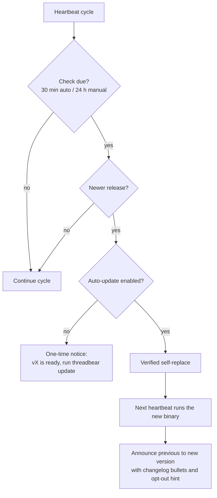

# Auto-Update - Plan

## Goal Capsule

- **Objective:** ThreadBear keeps itself current: an opt-out auto-update mode that applies new releases through the existing verified update path and announces each update in the main thread with a brief changelog.
- **Product authority:** `docs/plans/2026-07-23-001-feat-threadbear-plan.md` for all existing product behavior; this document for the auto-update surface.
- **Supersession:** the v1 contract's identity clause "ThreadBear does not install updates without user action" is superseded for this surface by owner decision (BEAR-39, 2026-07-26); the v1 doc carries the matching dated amendment. No local release history and no automatic rollback remain part of the identity.
- **Execution profile:** table-driven Go tests written with each unit (repo norm); release-workflow changes proven by the `v0.0.0-dryrun` tag rather than unit tests.
- **Stop conditions:** surface as a blocker anything that would weaken the shipped update gates (checksum, candidate self-test, atomic swap) or add config/CLI surface beyond the single `--auto-update` preference — both contradict this plan.
- **Open blockers:** none.

---

## Product Contract

### Summary

Turn the shipped notify-only update check into opt-out auto-update.
When enabled, the heartbeat checks for a new release at most every 30 minutes and installs it through the existing verified self-replace; the next heartbeat announces the update in the main thread with changelog bullets.
Install asks for consent (default yes), `configure` toggles it, and a root `CHANGELOG.md` becomes the single source of release notes.

### Problem Frame

Today the update loop stops at a notice.
The heartbeat checks once a day and posts "vX is ready — run threadbear update" into the main thread, and nothing happens until a person or agent acts, so installs go stale by default.
There is also no changelog anywhere: release notes are auto-generated from PR titles at publish time, the repo has no `CHANGELOG.md`, and nothing user-readable explains what a release changed.

### Key Decisions

- **Compose the shipped pieces; build no new update engine.** The manifest check, the checksummed and self-tested atomic self-replace, and the crash-safe staged notice delivery all exist. Auto-update is the missing wiring between them, plus a consent flag.
- **The toggle is a `configure` preference, not a new subcommand.** It behaves like `--archive` and `--rename`: one flag, same preview/confirm flow, shown in `status`. Because the skill documents the CLI for the main thread, main-thread control falls out with zero new mechanism.
- **Announce by version drift, not by update path.** The heartbeat announces whenever the running version differs from the last version it announced, so auto-applied, manually run, and installer-driven updates all share one mechanism — and the announcer is always the new binary describing itself. Costs at most one heartbeat of latency; buys deterministic, crash-safe notice text with no payload carried through recovery.
- **Release notes are embedded in the binary at build time.** The release build already extracts the version's changelog section for the release body; it also stamps up to three bullets into the binary, so the announcing binary carries its own notes. No manifest schema change, no runtime fetch, no GitHub API dependency.
- **Existing installs default to enabled at the schema-bump migration.** The strict config decode and the v1-to-v2 precedent mean a new preference bumps the schema version anyway, and that migration sets it enabled. Consent-by-default extends to the current (days-old, tiny) installed base; every announcement carries a one-line opt-out hint so the change is visible exactly when it matters.
- **Changelog maintenance is a release-gated convention, not per-PR CI.** Agents append `Unreleased` entries per the repo instructions; the release workflow hard-fails a tag with no matching section. No lint bots, no exemption labels.

### Requirements

**Auto-update behavior**

- R1. ThreadBear has an auto-update preference, enabled by default, persisted with the other preferences in its config.
- R2. With auto-update enabled, the heartbeat checks for a new release no more than once every 30 minutes; with it disabled, today's 24-hour notify-only check is unchanged.
- R3. Auto-apply reuses the existing verified update path — checksum verification, candidate version and self-test gates, atomic binary swap — invoked under the heartbeat's already-held store lock, with no weakening of those gates.
- R4. A failed check or apply leaves the installed binary and its schedule untouched: retry no sooner than the next due check, no message in the main thread. The most recent failure is recorded in state and reported by `threadbear status` — new behavior; today check errors are silently swallowed.

**Consent and control**

- R5. Interactive install asks one new question — whether ThreadBear should update itself — defaulting to yes; noninteractive installs default to enabled.
- R6. The CLI enables and disables auto-update through the existing `configure` command, with the same flag, preview, and confirm shape as other preferences.
- R7. The skill remains the complete CLI reference for the main thread and documents the auto-update preference, so toggling from the main thread needs no new mechanism.
- R8. Existing installs adopt auto-update enabled when their config migrates; the opt-out hint in the announcement (R12) is how that change is surfaced.
- R9. `threadbear status` reports the auto-update preference alongside the other preferences.

**Update announcement**

- R10. After any successful update — auto-applied, manually run, or installer-driven — the next heartbeat posts exactly one friendly bear-voice message in the main thread naming the previous and new versions, detected by comparing the running version with the last announced version.
- R11. The message includes a brief changelog: up to three bullets drawn from the new version's release notes, omitted gracefully when notes are unavailable.
- R12. The message ends with a one-line hint for turning auto-update off.
- R13. Announcement delivery is once per version and crash-safe, reusing the staged notice machinery with text regenerated deterministically from the new binary's version and embedded notes.
- R14. Fresh installs and the config migration seed the last-announced version to the currently running version, so a first heartbeat never posts a spurious update message.
- R15. While auto-update is enabled, the existing "vX is ready" notice is suppressed; the update is applied instead.

**Changelog pipeline**

- R16. `CHANGELOG.md` lives at the product repo root in Keep-a-Changelog-lite shape — an `Unreleased` section plus one section per released version — seeded with a v1.0.0 entry.
- R17. The repo's agent instructions require every PR with user-visible changes to add an entry under `Unreleased`, and cutting a release renames `Unreleased` to the new version.
- R18. The release workflow refuses to publish a tag whose version has no `CHANGELOG.md` section.
- R19. The GitHub release body is the version's `CHANGELOG.md` section, replacing the auto-generated notes.
- R20. The release build embeds the version's brief notes — up to three bullets from its changelog section — into the binary, so announcements need no extra network calls or GitHub API dependency.

### Key Flows

- F1. Auto-update
  - **Trigger:** heartbeat runs with auto-update enabled and 30 minutes or more since the last check.
  - **Steps:** check the release manifest; if newer, run the verified self-replace; the next heartbeat — now the new binary — sees the version drift and posts the announcement.
  - **Outcome:** binary current within one check window plus one heartbeat; one announcement in the main thread. **Covers R2, R3, R10-R13, R15.**
- F2. Toggle from the main thread
  - **Trigger:** user tells the main-thread agent to stop (or resume) auto-updating.
  - **Steps:** agent runs the documented `configure` toggle with the standard preview/confirm flow.
  - **Outcome:** subsequent heartbeats follow the new mode; disabled mode reverts to the 24-hour notice behavior. **Covers R6, R7.**
- F3. Cut a release
  - **Trigger:** maintainer (or agent) tags a release after PRs have accumulated `Unreleased` changelog entries.
  - **Steps:** release prep renames `Unreleased` to the version; the workflow gates on that section, publishes binaries, writes the section into the release body, and embeds the notes bullets into the built binaries.
  - **Outcome:** a release that carries its own user-readable changelog end to end. **Covers R16-R20.**

### Acceptance Examples

- AE1. **Covers R2, R3, R10-R13, R15.** Given auto-update enabled and v1.2.0 published, when the next due check runs, then the binary is replaced after passing the existing gates, and the following heartbeat posts exactly one message naming v1.1.x to v1.2.0 with up to three bullets and the opt-out hint; no "v1.2.0 is ready" notice appears.
- AE2. **Covers R2, R15.** Given auto-update disabled, when a new release ships, then behavior is identical to today: a check at most every 24 hours and a single "vX is ready" notice, with no self-replace.
- AE3. **Covers R10, R13.** Given a user runs `threadbear update` in a terminal and it succeeds, then the next heartbeat posts the same single announcement, and no duplicate is ever posted for that version.
- AE4. **Covers R4.** Given a download or checksum failure during auto-apply, then the installed binary is unchanged, nothing is posted to the main thread, `threadbear status` reports the failed attempt, and the next attempt happens no sooner than the next due check.
- AE5. **Covers R18.** Given a tag `v1.2.0` pushed without a `v1.2.0` section in `CHANGELOG.md`, then the release workflow fails before publishing anything.
- AE6. **Covers R5.** Given a noninteractive (agent-driven) install with no preference flags, then the resulting config has auto-update enabled.
- AE7. **Covers R14.** Given a fresh install of v1.2.0, when its first heartbeat runs, then no update announcement is posted.

### Scope Boundaries

- No rollback or downgrade automation: the posture is fix-forward via a new release. `update --version` still pins among feature-era releases, but it cannot cross this feature's boundary — once schema-v3 config or the new state fields are on disk, a pre-feature candidate fails its self-test against them, and backing out past the boundary means reinstalling with state deleted.
- No release channels (beta/stable), no configurable check cadence, no scheduling jitter.
- No signing or notarization work beyond the existing sha256 plus candidate self-test gates.
- No per-PR CI enforcement of changelog entries; the release-time gate is the only mechanical check.
- No update-deferral logic around in-flight work: the swap is process-safe by design (the running cycle finishes on the old code; the LaunchAgent's next tick runs the new binary).
- No failure notifications in the main thread; failures stay in `status` and logs.

### Dependencies / Assumptions

- The installed base is days old and tiny, which is what makes migrate-to-enabled (R8) a low-blast-radius default.
- GitHub Releases remains the sole distribution channel, per the existing install and update contract.

### Outstanding Questions

- **Deferred to implementation:** exact announcement and consent-prompt copy, in the established bear voice with the 🧵🐻 prefix convention; U5 carries a directional example.

### Sources / Research

- `internal/watch/cycle.go:22` — the 24-hour `updateInterval`; `:132` the due gate on `LastUpdateCheck`; `:176-186` the check, whose errors are currently swallowed (R4 makes them visible); `:489-570` staged notice delivery, per-version dedup, and `noticeText`.
- `internal/app/status.go:149` — status's `LastUpdateCheck` display; `:209` — status's independent hardcoded 24-hour due gate (the second site KTD7 removes).
- `internal/update/check.go` — manifest checker (`latest.json`); `internal/update/replace.go` — checksummed, self-tested, atomic self-replace, lock-free itself (callers hold the store lock).
- `internal/app/update.go` — the locked `update` command handler the CLI path keeps.
- `cmd/threadbear/main.go:412-454` — the `configure` flag pattern to mirror; `:334-345` — install accepts the same preference flags.
- `internal/install/prompts.go:111-157` — the interactive describe-and-ask preference collection the consent question joins.
- `internal/config/config.go:15-28,123-198` — strict schema decode and the v1-to-v2 migration precedent behind the schema-bump decision.
- `internal/state/model.go:118-126` — `State` fields; token fields landed as additions without a state schema bump (the precedent KTD2 follows).
- `internal/state/store.go:150` — the store lock is a non-blocking flock that fails fast with `ErrLocked` (the KTD3 behavior).
- `internal/install/install.go:507`, `internal/install/agents.go:122` — managed skill/AGENTS surfaces are written only during install (`applyManaged`/`WriteManagedBlock`), the gap KTD5 closes.
- `.github/workflows/release.yml` — binaries, sha256 sidecars, `latest.json` manifest, the `--generate-notes` body R19 replaces, and the build step R20 extends; supports a `v0.0.0-dryrun` tag useful for verifying the R18 gate.
- `assets/skill/SKILL.md` — the complete-CLI-reference pattern; already documents `update` and update-check state in `status`.
- `docs/plans/2026-07-26-v1.0.0-release-note.md` — source material for the seeded v1.0.0 changelog entry.
- `docs/plans/2026-07-23-001-feat-threadbear-plan.md` — the product contract this plan defers to for all existing behavior.

---

## Planning Contract

**Product Contract preservation:** unchanged, except Outstanding Questions now records only the copy deferral (planning resolved the former schema and due-gate questions into KTD1 and KTD7). One plan-added mechanism — drift-time managed-surface reconcile (KTD5) — is implementation scope in service of R7 and the existing self-test contract, confirmed with the owner at planning time.

The Product Contract's Key Flows diagram is the high-level technical design; no second diagram is warranted — the branching (mode gate) and the two-process lifecycle (apply in the old binary, announce from the new one) are both depicted there.

### Key Technical Decisions

- KTD1. **Config schema bumps to 3; legacy decode defaults the new field to enabled.** `auto_update_enabled` joins `Config`; `Decode` accepts schemas 1-3, defaulting the field to true when absent and requiring it at v3 (the same posture v2 took with `token_display`). The migrated value persists on the next config write, matching the v1-to-v2 precedent — until then the default is in-memory semantics, which is sufficient for R8.
- KTD2. **State schema stays 1; new fields are additive.** `last_announced_version` (string) and `last_update_failure` (code + timestamp) join `State` as `omitempty` fields — the token-display fields set this precedent. An empty `last_announced_version` means "adopt the running version silently"; that single rule *is* R14's seeding, needing no install-path code.
- KTD3. **The cycle calls `update.Replacer` directly, never the CLI update handler.** The heartbeat already holds the store lock, and the lock is a non-blocking flock — `app.UpdateHandler`'s re-acquire would fail fast with `ErrLocked` on every in-cycle attempt, so routing through the handler can never work. The Replacer is lock-free by design and its gates run unchanged, invoked under U3's fixed deadline.
- KTD4. **The announcement is a staged cycle operation keyed by version, with deterministic text.** A new operation kind rides the existing stage/apply/verify/recover notice machinery. Text derives from (`last_announced_version`, running version, embedded notes) — stable across crash recovery because `last_announced_version` advances only when the operation verifies at commit.
- KTD5. **Version drift triggers managed-surface reconcile.** Whenever the running version differs from `last_announced_version` — including the silent adopt-on-empty case — the cycle re-applies the managed skill block (always) and AGENTS block (when enabled) with the running binary's embedded content, using the existing `WriteManagedBlock` helpers. Today only install writes these, so any release that changes them leaves stale docs and a failing `self-test` after an update; auto-update would turn that latent bug into an every-release event, and this feature itself ships a skill-text change. Reconcile-before-announce ordering keeps the skill current when the user reads the message. A reconcile failure never blocks the announcement: it is recorded as a status-visible diagnostic and retried on later heartbeats via an additive `last_reconciled_version` state field that advances only on success.
- KTD6. **Notes embed via `go:embed` of a CI-written file.** A committed-empty `internal/update/notes.txt` is overwritten by the release workflow with up to three bullets from the version's changelog section before `go build`. `-ldflags -X` was rejected (multiline values); the manifest was rejected at requirements time.
- KTD7. **One shared mode-dependent interval helper feeds both due gates.** `cycle.go`'s `updateInterval` constant and `status.go`'s hardcoded 24h dry-run gate are replaced by a single helper on the config (30 minutes when enabled, 24 hours when disabled), so `status`/dry-run and the heartbeat can never disagree about when a check is due.
- KTD8. **The changelog release gate binds only on publishing releases.** The `v0.0.0-dryrun` tag has no changelog section by design and keeps working; the gate (and notes extraction) run when the tag is a stable `vN.N.N`.

### Assumptions

- The LaunchAgent execs the binary fresh each interval (StartInterval plist), so a swapped binary is picked up on the next tick with no daemon restart logic.
- The 60-second HTTP client timeout bounds only network calls (manifest, checksum, binary download); the candidate's `version` and `self-test` executions are bounded by U3's apply deadline, so a hung candidate cannot wedge the locked heartbeat. A slow or timed-out attempt delays one cycle at worst (the lock makes the overlapping tick a clean no-op).
- Go's `net/http` download does not set the quarantine xattr — the shipped manual update path already relies on this; auto-apply changes nothing about it.

### Sequencing

U1 → U2 (surfaces) and U3 (heartbeat) in either order → U4 (notes embed, independent until U5 consumes it) → U5 (drift announce + reconcile) → U6 (changelog pipeline).

---

## Implementation Units

### U1. Auto-update preference and config schema v3

- **Goal:** `auto_update_enabled` exists in config, defaulting to enabled everywhere.
- **Requirements:** R1, R8. **Covers KTD1.**
- **Dependencies:** none.
- **Files:** `internal/config/config.go`, `internal/config/config_test.go`.
- **Approach:** add the field to `Config` and `Default`; bump `CurrentSchemaVersion` to 3; extend `Decode` to accept 1-3, defaulting the field to true below v3 and requiring it at v3; no new validation beyond presence.
- **Patterns to follow:** the v1→v2 `token_display` handling in `Decode` (`internal/config/config.go:123-198`).
- **Test scenarios:** v2 config without the field decodes with auto-update enabled (Covers AE-adjacent R8); v3 config missing the field errors; v3 round-trips; legacy v1 decode still works and defaults enabled; unknown fields still rejected; `Default` has it enabled.
- **Verification:** `go test ./internal/config` green; decoding a real pre-upgrade config fixture yields enabled.

### U2. Preference surfaces: flag, install prompt, status, skill text

- **Goal:** the preference is visible and settable everywhere the other preferences are.
- **Requirements:** R5, R6, R7, R9. **Covers F2.**
- **Dependencies:** U1.
- **Files:** `internal/app/app.go` (ConfigPatch), `internal/app/configure.go` (applyConfigPatch), `cmd/threadbear/main.go` (registerConfigureFlags), `internal/install/prompts.go` (Preferences, Collect, conversions), `internal/app/status.go`, `internal/output/result.go` (Preferences struct + human status line), `assets/skill/SKILL.md`; tests: `internal/app/commands_test.go`, `internal/app/configure_lifecycle_test.go`, `internal/install/prompts_test.go`, `cmd/threadbear/main_test.go`.
- **Approach:** mirror `ArchiveEnabled` end to end — optionalBool `--auto-update` flag (works on both `configure` and `install`), a describe-and-ask prompt in `Collect` defaulting yes, Preferences plumbing, status JSON and human-line output. Skill text gains the `--auto-update` toggle in the lifecycle sentence and one line noting ThreadBear posts an update announcement after updating itself.
- **Test scenarios:** flag parses true/false and lands in ConfigPatch; `applyConfigPatch` applies it; Collect returns the default on bare Enter and honors "no" (Covers AE6's flag-free default via U1); status output includes the preference in JSON and the human footer.
- **Verification:** `go test ./...` green; `threadbear configure --auto-update=false --dry-run` previews a config write.

### U3. Mode-gated check, auto-apply, and failure recording in the heartbeat

- **Goal:** enabled installs check every 30 minutes and self-update; disabled installs behave exactly as today; failures become visible.
- **Requirements:** R2, R3, R4, R15. **Covers F1's first half.**
- **Dependencies:** U1.
- **Files:** `internal/watch/cycle.go`, `internal/watch/cycle_test.go`, `internal/app/status.go` (dry-run gate via KTD7 helper), `internal/state/model.go` (`last_update_failure`), `internal/output/result.go` (status failure display), `cmd/threadbear/main.go` (inject the Replacer as a new `Updater` dependency).
- **Approach:** replace the `updateInterval` constant with the KTD7 helper; in the update-due branch, when enabled and newer, call the injected Updater (KTD3) under a fixed deadline (`context.WithTimeout`, sized well inside the LaunchAgent interval) instead of staging the ready-notice; on any check or apply error — including deadline expiry — record `last_update_failure` (cleared on the next success), in both modes; the disabled path keeps today's notice behavior byte-for-byte, including `DeliveredNoticeVersions` dedup.
- **Test scenarios:** with fakes for checker and updater — enabled+newer invokes the updater and stages no ready-notice (Covers AE1's apply half); disabled+newer stages the notice exactly as the existing tests assert (Covers AE2); the due gate honors 30 minutes enabled / 24 hours disabled, and the status dry-run agrees via the shared helper; check failure and apply failure each record the failure code, leave `LastUpdateCheck` advanced (no tight retry loop), post nothing, and clear on a later success (Covers AE4); a hanging fake updater hits the deadline, the cycle still returns, and the expiry is recorded like any other failure; updater-nil yields the existing `update_checker_unavailable`-style diagnostic rather than a panic.
- **Verification:** `go test ./internal/watch ./internal/app` green; `threadbear status` shows the failure field when state carries one.

### U4. Embedded release notes

- **Goal:** the binary carries up to three changelog bullets for its own version.
- **Requirements:** R11, R20.
- **Dependencies:** none.
- **Files:** `internal/update/notes.go`, `internal/update/notes_test.go`, `internal/update/notes.txt` (committed empty placeholder).
- **Approach:** `go:embed notes.txt`; the accessor emits constrained plain text only — parse leading `- `/`* ` lines, trim, cap each bullet at 200 characters, strip or reject markdown links, code fences, and control characters, cap at three bullets, and return nil for an empty or whitespace file (R11's graceful omission — dev builds stay noteless). The announcement is the one channel where release prose reaches the agent-read main thread in ThreadBear's voice, so this parser is the validate-before-post boundary, matching the digits-and-dots discipline the shipped path applies to version strings. The release workflow writes the file before building (U6).
- **Test scenarios:** parses bullets; caps at three; empty file yields nil; non-bullet prose lines are ignored; oversize lines and lines carrying links, fences, or control characters are dropped; an all-invalid file yields nil.
- **Verification:** `go test ./internal/update` green.

### U5. Drift announcement and managed-surface reconcile

- **Goal:** after any successful update, the new binary announces itself once — with current skill/AGENTS surfaces on disk before the user reads it.
- **Requirements:** R10-R14 (R15's notice suppression lives in U3). **Covers F1's second half, KTD4, KTD5.**
- **Dependencies:** U1, U3, U4.
- **Files:** `internal/watch/cycle.go`, `internal/watch/cycle_test.go`, `internal/state/model.go` (`last_announced_version`), `cmd/threadbear/main.go` (inject a managed-surface reconciler built on `install.WriteManagedBlock` and the embedded assets).
- **Approach:** after state load — empty `last_announced_version` adopts the running version silently; a differing one stages the announce operation (new op kind on the notice machinery, KTD4) and, in both cases when the version moved, re-applies managed surfaces first (KTD5: skill always, AGENTS when `agents_enabled`). Commit advances `last_announced_version` only when the announce operation verifies. Reconcile failure never blocks the announce: record a status-visible diagnostic and retry on later heartbeats via the `last_reconciled_version` marker (KTD5). Announcement text is directional, not final copy: `🧵🐻 I gave myself a quick brush-up: v1.1.0 → v1.2.0! · <up to three bullets> · Prefer to update by hand? threadbear configure --auto-update=false`.
- **Test scenarios:** Covers AE7 — fresh state adopts silently, posts nothing, reconciles surfaces; Covers AE3 — state at an older announced version posts exactly one announcement, and a crash between apply and verify recovers without a duplicate (recovery re-derives identical text); Covers AE1's announce half — bullets and opt-out hint present, "is ready" notice absent; no drift means no reconcile write and no announcement; AGENTS reconcile respects `agents_enabled` false; a failing reconciler records its diagnostic, the announcement still posts, and reconcile retries next cycle; delivery verification matches the exact persisted text — pin byte-identical round-tripping of bullet-bearing announce text in a live-gated test beside the existing notice one.
- **Verification:** `go test ./internal/watch` green; after a simulated version bump in a test harness, `self-test`'s skill check passes against the new content.

### U6. Changelog file, convention, and release pipeline

- **Goal:** `CHANGELOG.md` exists and every release carries its own notes end to end.
- **Requirements:** R16-R20. **Covers F3, KTD6, KTD8.**
- **Dependencies:** U4.
- **Files:** `CHANGELOG.md` (new), `CLAUDE.md` (one convention bullet), `.github/workflows/release.yml`, and the behavior docs that today say ThreadBear never auto-updates: `docs/architecture.md`, `docs/compatibility.md`, `README.md`, `INSTALL.md`, `site/index.html`.
- **Approach:** seed `CHANGELOG.md` with `## Unreleased` plus a `## v1.0.0 - 2026-07-23` section condensed from `docs/plans/2026-07-26-v1.0.0-release-note.md`. Add the CLAUDE.md bullet: user-visible PRs append under `Unreleased`; release prep renames it to the version; the workflow enforces it. In `release.yml`, gated on `publish == 'true'` (KTD8): fail if `## v$VERSION` is missing (R18); extract the section to a file **outside `dist/`**, upload it as a second artifact, and have the publish job download it for `gh release create --notes-file` (dropping `--generate-notes`, R19) — the publish job uploads `dist/*` wholesale, so a notes file inside `dist/` would ship as a stray release asset; extract the section's first three bullets into `internal/update/notes.txt` before the build step (R20). Update the boundary and behavior lines in the listed docs to describe opt-out auto-update — the v1 contract amendment already records the decision; these files describe shipped behavior and flip in this PR.
- **Test scenarios:** Test expectation: none for the markdown files — docs. The workflow's gate and extraction are proven by verification below, not unit tests (Covers AE5 by observed CI failure on a sectionless stable tag).
- **Execution note:** this is packaging/CI; prefer smoke verification via the dryrun tag over test scaffolding for the awk/sed extraction.
- **Verification:** `v0.0.0-dryrun` tag runs green with the gate skipped; the first real release shows the changelog section as its body and the built binary announces with bullets.

---

## Verification Contract

| Gate | Command | Proves |
|---|---|---|
| Unit and integration tests | `go test ./...` | U1-U5 behavior, AE2-AE4, AE6-AE7, and AE1/AE3's in-process halves |
| Static checks | `go vet ./...` | repo CI gate stays green |
| Installer syntax | `sh -n install.sh` | untouched installer still passes the CI gate |
| Release pipeline smoke | push `v0.0.0-dryrun` | workflow with KTD8 gating: dryrun builds green without a changelog section |
| Live release smoke (post-merge) | with a feature build already installed, cut the following patch release with a changelog section | AE1 end to end on a real install: self-replace within one check window, one announcement with bullets, `threadbear self-test` fully green afterward (KTD5) — pre-feature binaries show only the old notice, so the smoke starts from a feature build |

---

## Definition of Done

- All of AE1-AE7 hold: AE2, AE3, AE4, AE6, AE7 and AE1's in-process half via `go test ./...`; AE1's live half and AE5 via the release smoke above.
- `threadbear status` shows the auto-update preference and, when present, the last update failure.
- `assets/skill/SKILL.md`, `CLAUDE.md`, `CHANGELOG.md`, and the U6 behavior docs (`docs/architecture.md`, `docs/compatibility.md`, `README.md`, `INSTALL.md`, `site/index.html`) updated as specified; no other doc surface changes.
- No CLI surface added beyond `--auto-update`; no new subcommands; no weakening of the shipped update gates.
- This plan file and the `docs/README.md` index line (already on disk, uncommitted) land with the implementation PR.
- Dead-end or experimental code from abandoned approaches is removed before declaring done.
